# Ansible Hardening Linux

[](LICENSE)
[](https://www.ansible.com/)

> Proyecto 7 de mi portfolio ASIR. Automatización con Ansible del hardening de seguridad de dos servidores Linux ya existentes (Zabbix Server y un host con Docker), gestionando usuarios, SSH, firewall y fail2ban.

**English version:** [README_EN.md](README_EN.md)

## Arquitectura

```
   Máquina física
        │ NAT
        ▼
  SRV-ANSIBLE-01 (control node)
        │ LAN Segment 1 — 192.168.100.0/24
        ├── SRV-ZABBIX  (.20) — Zabbix Server 6.4
        └── SRV-DOCKER  (.40) — Nginx, MariaDB, phpMyAdmin, Portainer
```

`SRV-ANSIBLE-01` tiene doble interfaz (NAT + LAN), como un *bastion host*. Los dos servidores gestionados ya existían de proyectos anteriores del portfolio — el objetivo aquí no fue crear infraestructura, sino hardenizarla.

## Stack

Ansible Core 2.16 · Ubuntu Server 22.04/24.04 · VMware Workstation · claves SSH ED25519 · UFW · Fail2ban

## Estructura del repo

```
ansible-hardening-linux/
├── ansible.cfg
├── site.yml
├── inventory/hosts.ini
├── group_vars/all.yml
├── host_vars/{srv-zabbix,srv-docker}.yml
├── roles/
│   ├── common/        → actualiza el sistema, paquetes base, timezone
│   ├── users/          → usuario ansible_adm, clave SSH, sudo
│   ├── ssh_hardening/  → puerto SSH custom, sin root, sin password
│   ├── firewall/       → UFW con políticas por host
│   └── fail2ban/       → protección SSH contra fuerza bruta
└── screenshots/
```

> `group_vars/` y `host_vars/` están junto a `site.yml` en la raíz, no en una subcarpeta — ver [punto 5](#5-las-variables-no-se-cargaban-dentro-del-playbook) de problemas encontrados.

---

## Cómo se construyó, paso a paso

### 1. Preparar el control node

`SRV-ANSIBLE-01` con dos interfaces de red: NAT (acceso desde la máquina física) y LAN Segment 1 (para llegar a los servidores gestionados).

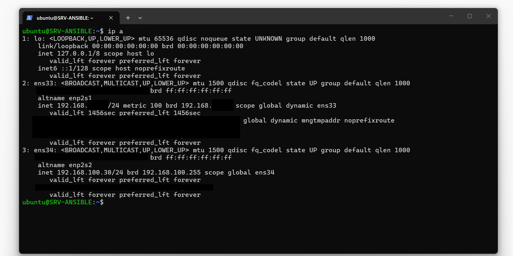

Primera comprobación de conectividad contra los dos managed nodes:

```bash
ansible -i inventory/hosts.ini linux_servers -m ping
```

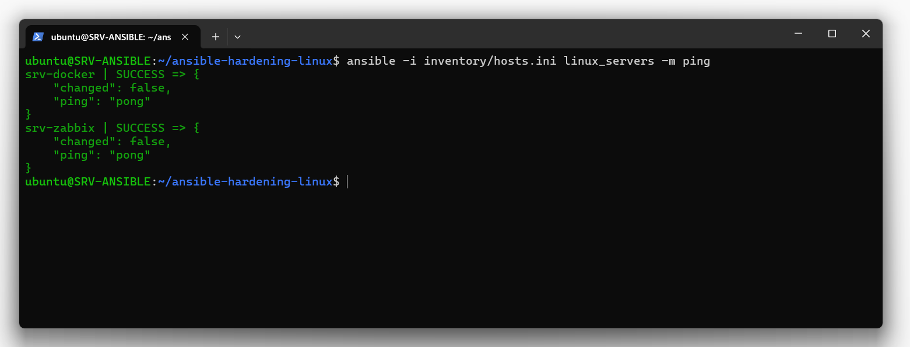

### 2. Estructura del proyecto

Roles con la convención estándar de Ansible (`defaults/`, `tasks/`, `handlers/`, `templates/`, `files/`):

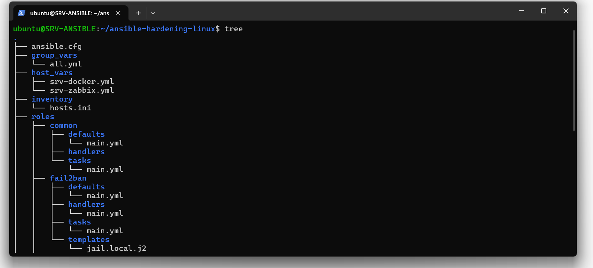
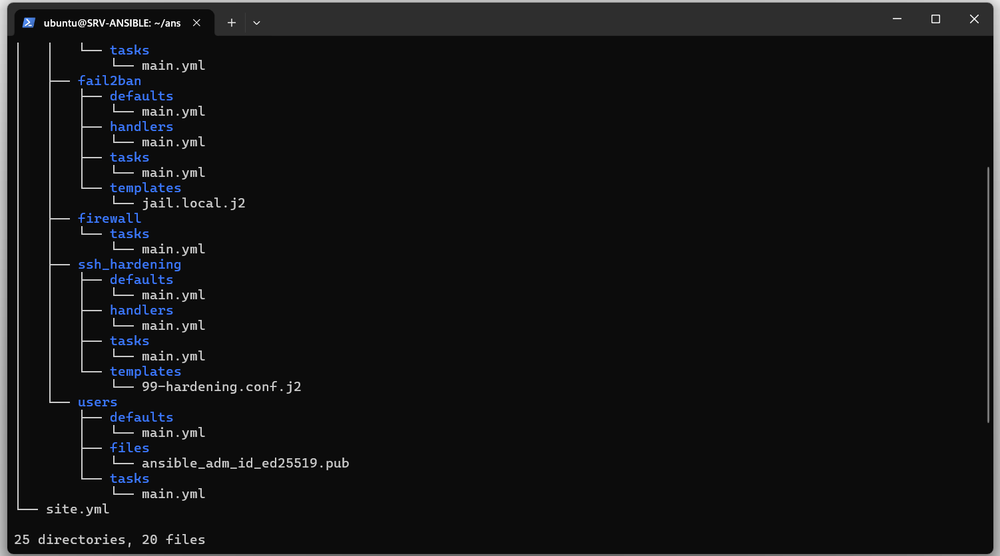

### 3. Rol `common`

Actualiza paquetes, instala herramientas base (curl, vim, htop, net-tools, unzip) y configura la zona horaria.

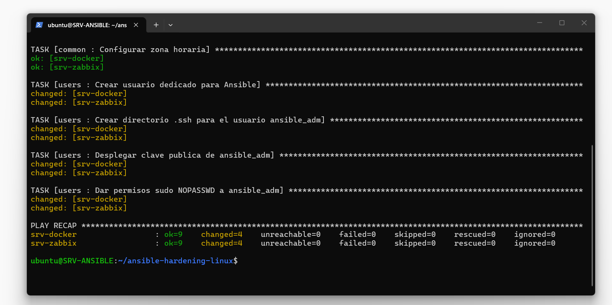

### 4. Rol `users`

Crea `ansible_adm`: usuario dedicado para Ansible, autenticación solo por clave SSH (ED25519), sudo sin contraseña.

```bash
ssh -i ~/.ssh/ansible_adm_id_ed25519 ansible_adm@<host> "whoami && sudo whoami"
```

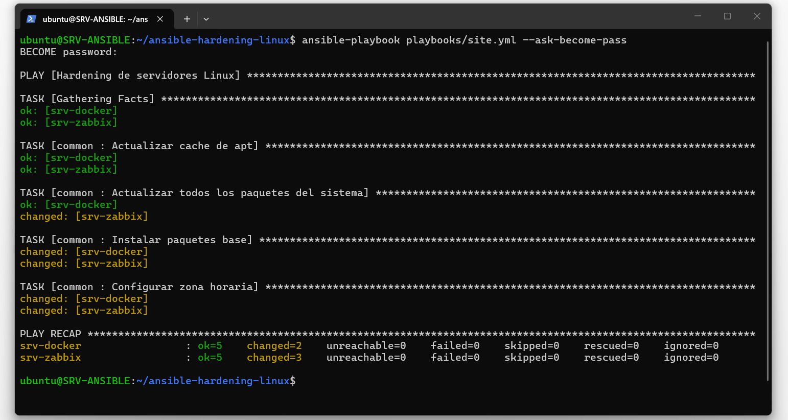

### 5. Rol `ssh_hardening`

Puerto SSH a 44331, `PermitRootLogin no`, `PasswordAuthentication no`. Esta fue la fase con más problemas reales — ver la sección de abajo.

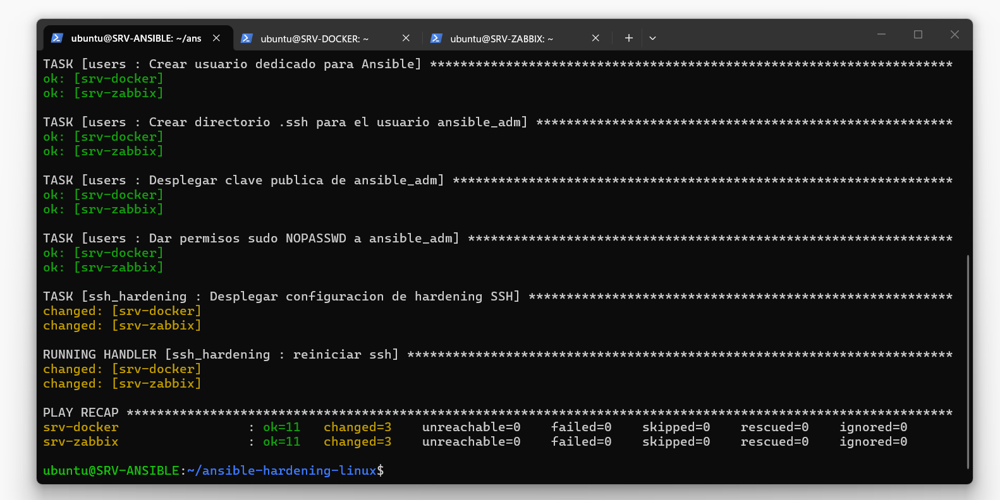

### 6. Rol `firewall`

Antes de escribir ninguna regla, se verificaron los puertos realmente en uso con `ss -tlnp` — nada de reglas por suposición:

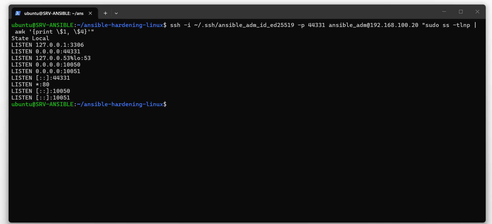

Para SRV-DOCKER, los puertos se confirmaron contra su `docker-compose.yml` real:

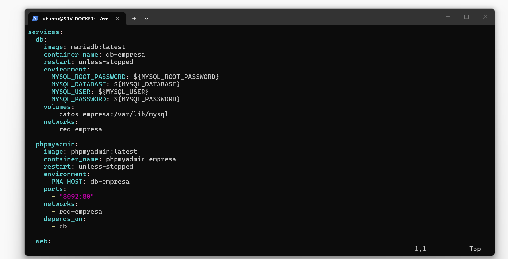

Reglas activas tras aplicar el rol:

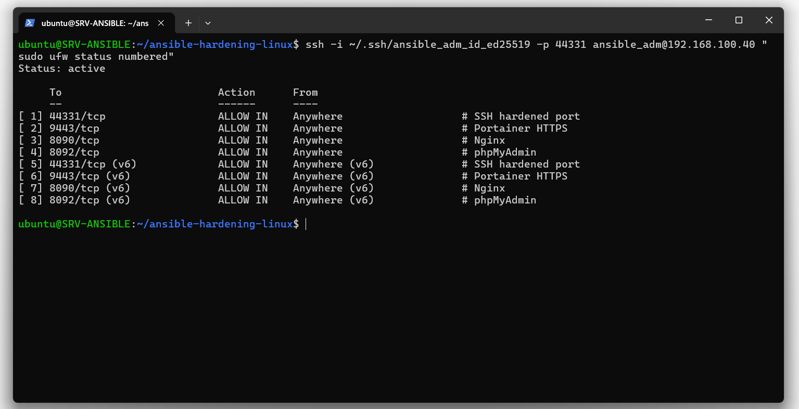

Play Recap tras `ssh_hardening` + `firewall`:

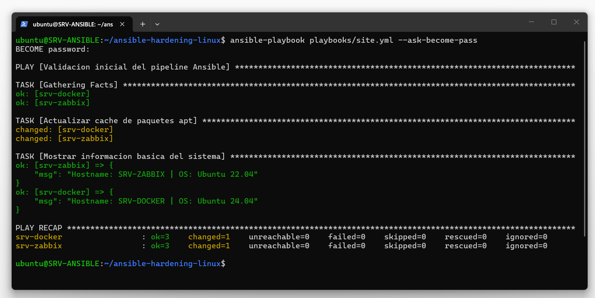

### 7. Rol `fail2ban`

Jail de SSH apuntando al puerto 44331 (no al 22, que es lo que fail2ban asume por defecto):

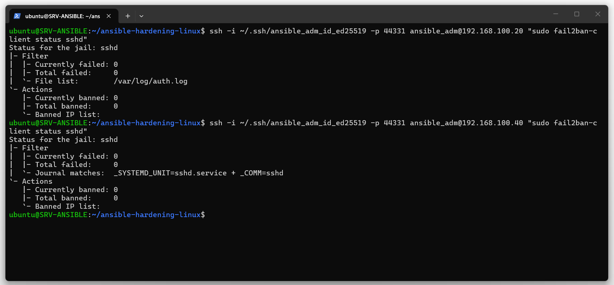

---

## Cómo ejecutarlo

```bash
git clone https://github.com/danieloio/ansible-hardening-linux.git
cd ansible-hardening-linux
ansible all -m ping
ansible-playbook site.yml
ansible-playbook site.yml --limit srv-zabbix   # contra un solo host
```

Adapta `inventory/hosts.ini`, `group_vars/all.yml` y `host_vars/*.yml` a tu propia infraestructura.

## Problemas encontrados

**1. NOPASSWD heredado en sudoers de SRV-ZABBIX.** La imagen base (LinuxVMImages.com) traía `%sudo ALL=(ALL:ALL) NOPASSWD:ALL`. Corregido con `visudo`.

**2. Timeout de `become` por latencia.** Tras arreglar el punto 1, seguía fallando con `Timeout (12s) waiting for privilege escalation prompt`. Cronometrando con `time` una conexión SSH+sudo equivalente, la sesión tardaba ~15s — por encima del timeout de 12s por defecto. Solución: `become_timeout = 30` en `ansible.cfg`.

**3. Puerto SSH duplicado.** Al cambiar el puerto vía override en `sshd_config.d/`, el servidor quedó escuchando en 22 *y* 44331 a la vez. OpenSSH trata varias directivas `Port` como acumulativas, no sustitutivas. Solución: tarea `lineinfile` que neutraliza el `Port 22` implícito del `sshd_config` principal.

**4. *Socket activation* de systemd ignorando el puerto.** Incluso arreglado el punto 3, SRV-DOCKER seguía solo en el 22. Causa: `ssh.socket` abre el puerto él mismo con `ListenStream=0.0.0.0:22` hardcodeado, antes de que `sshd` lea su configuración. Solución: deshabilitar `ssh.socket` y dejar que `ssh.service` arranque de forma independiente.

**5. Las variables no se cargaban dentro del playbook.** `firewall_common_allowed_ports` daba `undefined` en el playbook, pero se resolvía bien con `ansible-inventory` y comandos ad-hoc. Causa: el playbook vivía en `playbooks/site.yml`, mientras que `group_vars/`/`host_vars/` estaban en la raíz — Ansible busca esas carpetas junto al inventario *y* junto al playbook en ejecución. Solución: mover `site.yml` a la raíz del repo.

## Decisiones de seguridad

- **NOPASSWD para `ansible_adm` + solo clave SSH (sin contraseña de login).** No es el mismo riesgo que el punto 1: aquí el único vector de entrada es poseer la clave privada, no una contraseña adivinable.
- **Cambio de puerto SSH = mitigación de ruido, no seguridad fuerte.** Reduce el escaneo automatizado de bots, no detiene un ataque dirigido.
- **Reglas de firewall basadas en evidencia (`ss -tlnp`), no en suposición.** MariaDB y el Zabbix Agent local no necesitaron reglas porque no eran accesibles desde la red.

## Posibles ampliaciones

- Ansible Vault para variables sensibles
- Reglas salientes restrictivas en el rol `firewall`
- `unattended-upgrades` como rol independiente
- Testing con Molecule

## Autor

**Daniel Moisés Loyo Vásquez** — Técnico ASIR · [GitHub](https://github.com/danieloio)
